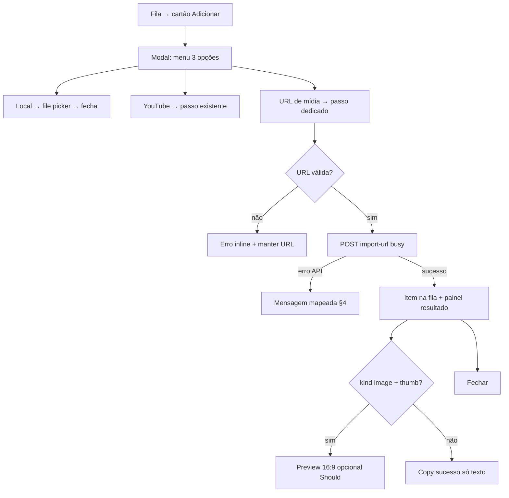

# UX Handoff — Modal «URL de mídia» na fila (CAD-231)

**Iniciativa:** [CAD-228](/CAD/issues/CAD-228)  
**Escopo PM:** [escopo.md](./escopo.md)  
**Implementação:** [CAD-232](/CAD/issues/CAD-232) (API + wiring) · **QA:** [CAD-233](/CAD/issues/CAD-233)  
**Gates:** [CAD-229](/CAD/issues/CAD-229) Security · [CAD-230](/CAD/issues/CAD-230) Compliance

**Verificação visual (2026-05-28):** mock `mock-modal-media-url.html` + protótipo Vue `QueueAddMediaModal.vue` (passo `mediaUrl`, `postMediaUrlImport`). Screenshots Chrome headless no diretório do escopo: `screenshot-desktop-menu.png`, `screenshot-desktop-media-url.png`, `screenshot-desktop-success.png`, `screenshot-mobile-menu.png`, `screenshot-mobile-media-url.png` (1440×900 / 390×844). [CAD-232](/CAD/issues/CAD-232) falta apenas API servidor + smoke.

---

## 1. Decisão de IA no modal (Hick + Chunking + Jakob's Law)

| Opção | Decisão | Lentes |
|-------|---------|--------|
| Campo URL no menu principal | **Rejeitada** — três fontes distintas (local / YouTube / CDN) aumentam erro de colagem (Paradox of the Active User). | Hick's Law, Choice Overload |
| Subfluxo «URL de mídia» separado de YouTube | **Aprovada** — mesmo padrão mental que passo YouTube; Progressive Disclosure. | Chunking, Mental Models |
| Selector `download` vs `reference` no MVP | **Oculto** — default servidor `download`; modo `reference` só via API até settings (Could). | Pareto 80/20, Tesler's Law |
| Ícones distintos YouTube vs CDN | **Aprovado** — YouTube mantém `Link2`; URL genérica usa `Globe` (Lucide não exporta `Youtube`). | Gestalt Similarity, Signifiers |

**Ordem no menu (Serial Position):** 1) Ficheiro local · 2) YouTube · 3) URL de mídia — frequência esperada local > YouTube > CDN genérico.

---

## 2. Fluxo operador

**Tempos (Doherty Threshold):** feedback imediato ao clicar Importar (`busy`, botão desabilitado, copy «A importar…»). Downloads grandes podem exceder 400ms — manter spinner no botão primário, não fechar modal até resposta.

---

## 3. Anatomia UI (tokens existentes — sem one-offs)

Reutilizar **exactamente** o shell de `QueueAddMediaModal.vue`:

| Elemento | Classe / token |
|----------|----------------|
| Overlay | `fixed inset-0 z-50 … bg-black/60 p-4` |
| Card | `max-w-md rounded-xl border border-lp-surface bg-lp-background shadow-xl` |
| Header | `border-b border-lp-surface px-4 py-3`, título `text-sm font-semibold text-lp-text` |
| Opção menu | `flex w-full items-center gap-3 rounded-lg border border-lp-surface px-4 py-3 … hover:border-lp-primary/50` |
| Campo URL | `mt-1 w-full rounded-lg border border-lp-surface bg-lp-background px-3 py-2 text-sm` |
| Label campo | `block text-xs uppercase tracking-wider text-lp-muted` |
| Primário | `rounded-lg bg-lp-primary px-4 py-2 text-sm font-medium text-white` |
| Sucesso | `border-emerald-500/40 bg-emerald-950/40 text-emerald-100` |
| Aviso | `border-amber-500/40 bg-amber-950/40 text-amber-100` |
| Erro | `border-rose-500/40 bg-rose-950/40 text-rose-200` |

**Passo `mediaUrl`:** espelhar layout do passo YouTube (hint → label+input → Voltar + Importar). Após sucesso, espelhar `youtubeImportDone` com hint + botão Fechar.

**Preview pós-import (Should):** abaixo do copy de sucesso, `aspect-video max-h-40 w-full overflow-hidden rounded-lg border border-lp-surface bg-black`:

- `kind === 'image'`: ``
- `kind === 'video'` com `thumbPath`: thumb via `mediaUrl(thumbPath)`
- Sem thumb: omitir bloco (não mostrar caixa vazia — Nielsen #8).

---

## 4. Copy e mapeamento de erros (Plain Language + Forgiveness)

Chaves em `locales/pt-BR.json` → secção `queueAdd` (entregues neste handoff).

| Situação | Chave i18n | Mensagem operador |
|----------|------------|-------------------|
| Menu | `optionMediaUrl` | URL de imagem ou vídeo |
| Hint passo | `mediaUrlHint` | Cole o link direto do ficheiro (PNG, JPG, MP4…). O servidor descarrega para a biblioteca local. Não use links com login ou páginas web. |
| Label | `mediaUrlLabel` | URL da mídia |
| Placeholder | `mediaUrlPlaceholder` | `https://cdn.exemplo.org/slide.png` |
| Busy | `importing` | (reutilizar) |
| Sucesso download | `mediaUrlResultDownload` | Ficheiro importado para a biblioteca local. O item já está na fila. |
| Sucesso reference | `mediaUrlResultReference` | Item adicionado com link remoto. Se a projeção falhar, o servidor do ficheiro pode bloquear o browser (CORS) — prefira importação local quando possível. |
| Pós-sucesso | `mediaUrlDoneHint` | O item foi adicionado à fila. Feche quando tiver lido o resultado acima. |
| URL vazia | `errors.mediaUrlRequired` | Indique a URL da imagem ou vídeo. |
| Falha genérica | `errors.mediaUrlFailed` | Não foi possível importar a partir da URL. |
| YouTube na rota genérica | `errors.mediaUrlUseYoutube` | Este link é do YouTube. Use «Importar vídeo do YouTube» no menu anterior. |
| SSRF / rede privada | `errors.mediaUrlSsrf` | Endereço não permitido. Use um link público na internet (https://). |
| Tipo / HTML | `errors.mediaUrlUnsupported` | O endereço não é uma imagem ou vídeo suportado. |
| Tamanho | `errors.mediaUrlTooLarge` | Ficheiro demasiado grande (máx. 50 MB imagem, 600 MB vídeo). |
| Timeout | `errors.mediaUrlTimeout` | O download demorou demasiado. Tente outro link ou ficheiro mais pequeno. |
| SSL | `errors.mediaUrlSsl` | Ligação segura falhou. Confirme que o site usa HTTPS válido. |
| 404 API | `errors.serverOutdated` | (reutilizar — incluir `cad228`/`import-url` na mensagem CTO) |
| Token na URL (Compliance) | `mediaUrlPrivacyNote` | **No hint**, frase final: «Evite URLs com palavras-passe ou tokens na query.» |

**Mapeamento cliente (`mapMediaUrlError`):** se corpo JSON tiver `code` ou substring na mensagem, preferir chave i18n; senão mostrar mensagem do servidor (Postel's Law). Códigos sugeridos para CTO alinhar com Security: `youtube_redirect`, `ssrf_blocked`, `unsupported_type`, `size_exceeded`, `timeout`, `ssl_failed`.

---

## 5. Distinção YouTube vs URL genérica (Norman — conceptual model)

| | YouTube | URL de mídia |
|---|---------|----------------|
| Entrada | watch/youtu.be | CDN, stock, slide hospedado |
| API | `postYoutubeImport` | `postMediaUrlImport` |
| Ícone menu | `Link2` | `Globe` |
| Resultado embed | Aviso âmbar `resultEmbed` | N/A no MVP download |
| Servidor | Rejeita URL YT no `import-url` | Operador redireccionado por copy §4 |

---

## 6. Acessibilidade (WCAG POUR)

- `role="dialog"` + `aria-modal="true"` + `aria-label` = `queueAdd.title` (existente).
- Campo URL: `type="url"`, `autocomplete="url"`, associado a `<label>` visível.
- Estados erro/sucesso: `role="alert"` nos parágrafos de feedback quando visíveis.
- Alvo mínimo 44×44 nos botões menu (`py-3` já cumpre).
- `prefers-reduced-motion`: sem animação nova; spinner só via copy «A importar…».

---

## 7. Critérios de aceite UX (ligação CA escopo)

| CA | Verificação UX |
|----|----------------|
| CA-1–2 | Passo URL → sucesso verde + item na fila; preview imagem quando PNG |
| CA-3 | URL YouTube → erro `mediaUrlUseYoutube`, permanece no passo |
| CA-5 | Erro legível (tipo/tamanho) sem jargão HTTP |
| CA-6 | Tile fila igual upload local após sucesso |
| CA-7 | Se `mode: reference` entregue: aviso âmbar `mediaUrlResultReference` |
| CA-8 | Regressão: menu local + YouTube inalterados em copy e layout |

---

## 8. Handoff implementação ([CAD-232](/CAD/issues/CAD-232))

| Artefacto | Acção |
|-----------|--------|
| `QueueAddMediaModal.vue` | **Entregue (UX)** — passo `mediaUrl`, preview, mapeamento erros; CTO valida regressão YouTube/local |
| `queue-import-api.ts` | **Entregue (UX)** — `postMediaUrlImport` com fallbacks; aguarda endpoint |
| `locales/pt-BR.json` | **Entregue (UX)** — chaves §4 |
| `server/routes/queue-import.ts` | Endpoint + mensagens/códigos §4 |
| Storybook | N/A — componente sem Storybook no repo |

**Não fazer no UX:** validação SSRF, fetch, logs — [CAD-229](/CAD/issues/CAD-229).

---

## 9. Riscos residuais

| Risco | Mitigação UX |
|-------|----------------|
| Operador cola página HTML em vez de ficheiro | Hint + erro `unsupported_type` |
| URL autenticada vaza em logs | `mediaUrlPrivacyNote` no hint (Compliance) |
| CORS em `reference` | Aviso pós-sucesso; MVP default download |
| Confusão com YouTube | Ícones distintos + erro dedicado CA-3 |

---

## 10. Histórico

| Versão | Data | Alteração |
|--------|------|-----------|
| 1.0 | 2026-05-28 | Handoff inicial UXDesigner (CAD-231) |
| 1.1 | 2026-05-28 | Protótipo Vue + i18n + screenshots; gate UX fechado |
