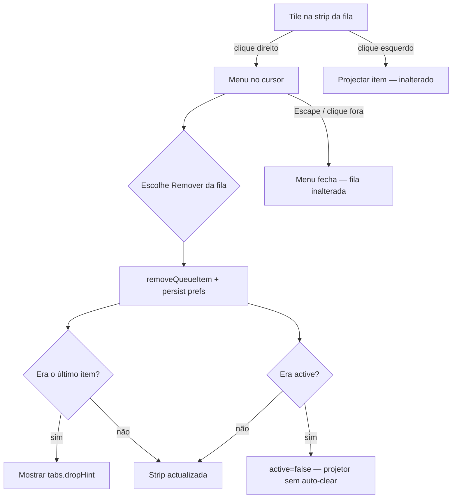

# UX Handoff — Menu contextual «Remover da fila» (CAD-234)

**Iniciativa:** [CAD-234](/CAD/issues/CAD-234)  
**Escopo PM:** [escopo.md](./escopo.md)  
**Implementação:** [CAD-236](/CAD/issues/CAD-236) (CTO) · **QA:** [CAD-237](/CAD/issues/CAD-237)

**Verificação visual (2026-05-28):** mock `mock-queue-context-menu.html` — screenshots Chrome headless no diretório do escopo: `screenshot-desktop-menu.png`, `screenshot-mobile-menu.png` (1440×900 / 390×844). Superfície: strip da fila em `ChromeTabPanel.vue` (as-is sem menu; mock representa to-be).

---

## 1. Decisão de interacção

| Decisão | Escolha | Lentes |
|---------|---------|--------|
| Acção de remoção | **Clique direito** no tile → menu com uma entrada | Jakob's Law (paridade `MediaTileContextMenu`, `QuickBackgroundsStrip`) |
| Confirmação | **Nenhuma** — remoção imediata | Forgiveness (escopo); paridade com fechar aba (×) |
| Apagar ficheiro da biblioteca | **Não** — só remove ponteiro na fila | Mental model; evitar Loss Aversion indevida |
| Item activo removido | Limpa `active`; **não** envia `removeConteudo` | Tesler's Law — complexidade no estado, não no projetor ao vivo |
| Undo | **Fora de escopo** | Pareto 80/20 |
| Cartão «Adicionar» (`isBlankQueue`) | **Sem** menu contextual | Progressive Disclosure — não é item da fila |

**Hick's Law:** menu de **uma única** opção — sem submenus, sem separadores, sem ícones redundantes no MVP.

---

## 2. Fluxo operador



**Meta de desempenho (Goal-Gradient):** remoção + adicionar substituto &lt; 10 s — feedback visual imediato ao escolher o menuitem (tile desaparece no mesmo frame; Doherty Threshold).

---

## 3. Anatomia UI (tokens existentes — sem one-offs)

Reutilizar **exactamente** o shell do menu em `MediaTileContextMenu.vue` / `QuickBackgroundsStrip.vue`:

| Elemento | Classe / token |
|----------|----------------|
| Menu container | `fixed z-[60] min-w-[14rem] rounded-md border border-lp-surface bg-lp-background py-1 text-sm text-lp-text shadow-lg` |
| Posição | `left: clientX`, `top: clientY` (px inline, como hoje) |
| Item | `w-full px-3 py-2 text-left hover:bg-lp-surface` |
| `role` | `menu` no `<ul>`; `menuitem` no `<button type="button">` |

**Cor do item destrutivo:** manter **neutro** (sem `text-rose-*`) — alinhado ao × da aba e ao resto dos menus contextuais (Norman signifiers consistentes). A única entrada já comunica intenção pelo copy.

**Não** envolver tiles em `MediaTileContextMenu.vue` — esse componente traz modais de biblioteca; usar o **mesmo padrão** inline em `ChromeTabPanel.vue` (como `QuickBackgroundsStrip.vue`).

### 3.1 Eventos no tile (`<li>` do item)

| Evento | Comportamento |
|--------|----------------|
| `@contextmenu.prevent` | Abre menu; `preventDefault` impede menu nativo do browser |
| `@click` | **Inalterado** — projecta; menu **não** abre |
| `draggable="true"` | **Inalterado** — botão direito não inicia drag (comportamento nativo) |
| Cartão «Adicionar» | **Sem** `@contextmenu` |

Estado do menu (refs sugeridos): `queueMenuOpen`, `queueMenuX`, `queueMenuY`, `queueMenuTabId`, `queueMenuItemId` — um menu global por strip, não um por tile.

Listeners documento (paridade existente): `click` → fecha; `keydown` Escape → fecha.

### 3.2 Após remoção

- Tile removido da lista sem animação no **Must** (Could: animação de saída).
- Se `activeItems.length === 0` após remoção, o bloco `tabs.dropHint` já presente em `ChromeTabPanel.vue` torna-se visível (CA-8).
- Foco: **não** mover foco para o projetor; se o tile removido tinha foco, mover para o tile à mesma posição ou anterior (mínimo: `document.activeElement` não fica em nó removido — opcional `focus()` no vizinho).

---

## 4. Copy e i18n (Plain Language)

Chaves novas em `locales/pt-BR.json` → secção **`queueItem`**:

| Chave | pt-BR | Uso |
|-------|-------|-----|
| `queueItem.removeFromQueue` | Remover da fila | Rótulo visível do `menuitem` |
| `queueItem.removeFromQueueAria` | Remover «{label}» da fila | `aria-label` no botão (`label` = `item.label` truncado se &gt; 40 chars) |

**Não** usar «Apagar», «Eliminar ficheiro» ou «Excluir da biblioteca» — reforça mental model errado (escopo §4).

Secção `install/locales/pt-BR.json`: espelhar as mesmas chaves (convenção do repo).

---

## 5. Lógica de estado (handoff CTO)

```ts
function removeQueueItem(tabId: string, itemId: string): void {
  const tab = prefs.value.chromeTabs.find((t) => t.id === tabId);
  if (!tab?.items) return;
  const item = tab.items.find((i) => i.id === itemId);
  if (!item) return;
  // Se active: limpar flag apenas — NÃO sendAction removeConteudo
  tab.items = tab.items.filter((i) => i.id !== itemId);
  // persist via watch existente em usePreferences
}
```

**Tipos:** todos os `QueueItemKind` — `music`, `bible`, `image`, `video`, `blank` (CA-2).

**Persistência:** `localStorage` `livepraise.operator.prefs` — sem API.

---

## 6. Acessibilidade (WCAG POUR)

| Critério | Especificação |
|----------|----------------|
| Estrutura | `role="menu"` + `role="menuitem"` |
| Nome acessível | `aria-label` = `t('queueItem.removeFromQueueAria', { label })` |
| Teclado MVP | Escape fecha menu (já no padrão) |
| Teclado Could | Delete com tile focado — **fora do Must** |
| Alvo | `py-2` + largura total ≈ ≥44px altura no desktop |
| Contraste | `text-lp-text` sobre `bg-lp-background` — tokens existentes |
| Motion | Sem animação nova; respeitar `prefers-reduced-motion` global |

**Selective Attention:** menu `z-[60]` — acima da strip, abaixo de modais `z-[70]` (`MediaTileContextMenu`).

---

## 7. Critérios de aceite UX (ligação CA escopo)

| CA | Verificação UX |
|----|----------------|
| CA-1 | Música: menu → remoção → tile some; reload mantém |
| CA-2 | Todos os `kind`; YouTube thumb tile incluído |
| CA-3 | Item activo removido — projetor **inalterado** (sem flash de clear) |
| CA-4 | Copy não sugere apagar ficheiro |
| CA-5 | Drag reorder + drop painéis regressão |
| CA-6 | Escape / clique fora fecha; clique esquerdo não abre menu |
| CA-7 | Chaves `queueItem.*` + `aria-label` |
| CA-8 | Último item → `tabs.dropHint` visível |

---

## 8. Handoff implementação ([CAD-236](/CAD/issues/CAD-236))

| Artefacto | Acção |
|-----------|--------|
| `usePreferences.ts` | Adicionar `removeQueueItem(tabId, itemId)` e export |
| `ChromeTabPanel.vue` | `@contextmenu.prevent` nos `<li>` de item; menu + handler |
| `locales/pt-BR.json` + `install/locales/pt-BR.json` | Secção `queueItem` §4 |
| `MediaTileContextMenu.vue` | **Não alterar** — só referência visual |
| Storybook | N/A |

**QA ([CAD-237](/CAD/issues/CAD-237)):** viewports 1440×900 e 390×844; estados: fila com 3 tiles (música + imagem + vídeo), menu aberto, pós-remoção vazia, item activo removido + inspecção WS.

---

## 9. Riscos residuais

| Risco | Mitigação UX |
|-------|----------------|
| Operador confunde com apagar da biblioteca | Copy «da fila»; sem ícone de lixo |
| Remover item ao vivo por engano | Sem confirmação (produto); Could: undo futuro |
| Menu sob viewport | CTO: clamp opcional `min(clientX, innerWidth - 224)` — **Should**, não bloqueia Must |
| Clique direito durante drag | Raro; `preventDefault` no contextmenu não afecta drag left-button |

---

## 10. Histórico

| Versão | Data | Alteração |
|--------|------|-----------|
| 1.0 | 2026-05-28 | Handoff inicial UXDesigner ([CAD-235](/CAD/issues/CAD-235)) |
