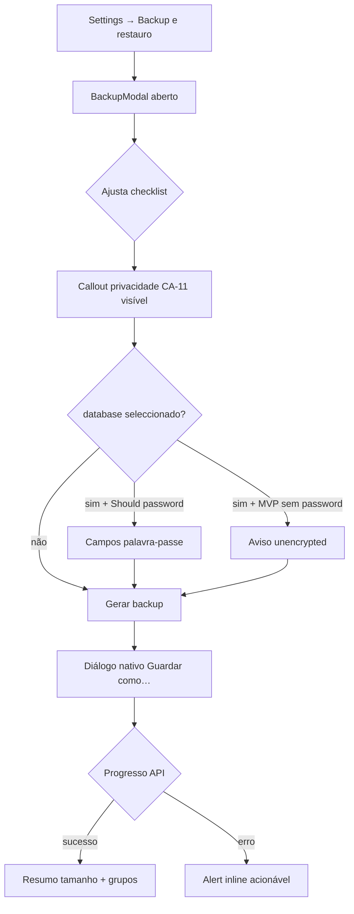
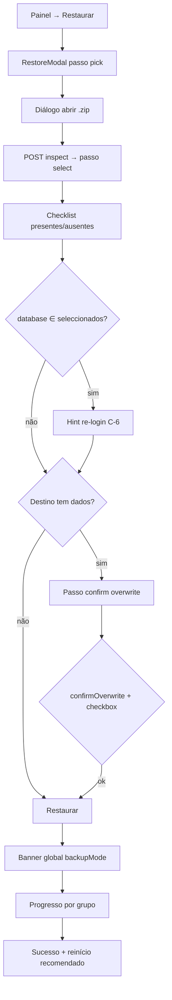

# UX Handoff — Modais Backup / Restore (CAD-240)

**Iniciativa:** [CAD-238](/CAD/issues/CAD-238)  
**Escopo PM:** [escopo.md](./escopo.md) §3.3–3.4  
**Compliance:** [CAD-239](/CAD/issues/CAD-239) · [parecer-compliance.md](./parecer-compliance.md) (C-1–C-6)  
**Implementação:** [CAD-241](/CAD/issues/CAD-241) (CTO) · **QA:** [CAD-242](/CAD/issues/CAD-242)

**Verificação visual (2026-05-28):** mock `mock-backup-restore-modals.html` — screenshots Chrome headless no diretório do escopo: `screenshot-desktop-backup.png`, `screenshot-desktop-restore.png`, `screenshot-mobile-backup.png`, `screenshot-mobile-restore.png` (1440×900 / 390×844). Superfície: painel Settings «Backup e restauro» + modais to-be (as-is inexistente).

**Verificação visual branch (2026-05-31, [CAD-293](/CAD/issues/CAD-293)):** operador real em `http://127.0.0.1:3847/operator/` — screenshots em `ux-verify-cad293/` (1440×900 desktop + 390×844 mobile): painel Settings, `BackupModal` defaults, `RestoreModal` passo `pick`. **Veredito:** alinhado ao handoff Must; deltas não bloqueantes abaixo §14.

---

## 1. Decisões de IA e interacção

| Decisão | Escolha | Lentes |
|---------|---------|--------|
| Ponto de entrada | Novo painel Settings **`backupRestore`** (admin) + dois modais dedicados | Jakob's Law — paridade `ErrorLogPanel`, `UsersPanel` |
| Backup vs Restore | **Modais separados** — acções distintas, risco diferente | Hick's Law, Mental Models |
| Checklist Backup | Uma lista vertical com hints; **todos marcados** excepto `error_log` | Privacy by default (C-2), Chunking |
| Checklist Restore | Grupos **no zip** marcados; **ausentes** visíveis mas `disabled` + hint | Recognition over Recall (CA-3), Signifiers |
| Confirmação overwrite | **Passo dedicado** no modal Restore — não `window.confirm` | Forgiveness, Norman feedback |
| Palavra-passe no zip | **Should** — campos quando `database` ∈ seleccionados; MVP sem API: aviso `privacyUnencryptedWarning` | Loss Aversion, Compliance §3 |
| Progresso zip grande | Barra + copy de grupo actual; modal **não fecha** até fim | Doherty Threshold, Goal-Gradient |
| Pós-restore BD | Banner sucesso + «Reiniciar aplicação» recomendado; copy re-login (C-6) | Peak-End Rule |
| Menu Settings | Item **oculto** se `role !== 'admin'` | Progressive Disclosure (CA-10) |
| Loopback Electron sem sessão | Tratar como **admin** (paridade servidor local) | Tesler's Law |

**Não fazer:** fundir backup/restore num único modal com tabs — aumenta erro de direcção (operador quer «guardar», não «importar»).

---

## 2. Fluxos

### 2.1 Backup



### 2.2 Restore



**Meta operacional (escopo §6):** migração BD + louvor + imagens &lt; 15 min — checklist defaults reflectem o caminho feliz (tudo excepto `error_log` e opcionalmente `media_videos` desmarcado manualmente para PCs novos com vídeos já copiados — hint no grupo, não default off).

---

## 3. Anatomia UI (tokens existentes — sem one-offs)

Reutilizar shell **`SettingsModal.vue`**:

| Elemento | Classe / token |
|----------|----------------|
| Overlay | `fixed inset-0 z-50 … bg-black/60 p-4` |
| Card modal | `max-w-2xl` (Backup) · `max-w-2xl` Restore pick/select · `wide` (`max-w-4xl`) se checklist + callout exigir scroll horizontal em mobile — preferir `max-w-2xl` + scroll vertical |
| Header | `border-b border-lp-surface px-4 py-3`, título `text-sm font-semibold text-lp-text` |
| Corpo | `min-h-0 flex-1 overflow-y-auto p-4` (slot existente) |
| Intro painel | `text-sm text-lp-muted` (paridade `ErrorLogPanel`) |
| Item checklist | `flex items-start gap-2 rounded border border-lp-surface px-3 py-2` — paridade `ErrorLogPanel` checkbox |
| Label grupo | `font-medium text-lp-text` |
| Hint grupo | `text-xs text-lp-muted` |
| Item desabilitado | `opacity-50 cursor-not-allowed` + `input:disabled` |
| Callout privacidade (CA-11) | `rounded-lg border border-amber-500/40 bg-amber-950/40 px-3 py-2 text-sm text-amber-100` |
| Aviso destrutivo overwrite | `rounded-lg border border-rose-500/40 bg-rose-950/40 px-3 py-2 text-sm text-rose-200` |
| Sucesso | `border-emerald-500/40 bg-emerald-950/40 text-emerald-100` |
| Erro | `border-rose-500/40 bg-rose-950/40 text-rose-200`, `role="alert"` |
| Primário | `rounded-lg bg-lp-primary px-4 py-2 text-sm font-medium text-white disabled:opacity-50` |
| Secundário | `rounded-lg border border-lp-surface px-4 py-2 text-sm text-lp-muted` |
| Destrutivo confirm | `rounded-lg bg-rose-700 px-4 py-2 text-sm font-medium text-white` |
| Footer acções | `flex justify-end gap-2 border-t border-lp-surface px-4 py-3` — **dentro** do slot ou wrapper no modal filho |
| Barra progresso | `h-2 w-full overflow-hidden rounded-full bg-lp-surface` + fill `bg-lp-primary transition-all` |
| Banner global backupMode | `border-b border-amber-500/40 bg-amber-950/50 px-4 py-2 text-center text-sm text-amber-100` — ab abaixo de `ActionBar`, `z-40` |

**Hierarquia (Gestalt Proximity):** intro → checklist → callout privacidade → footer acções. Callout **sempre** acima dos botões, visível sem scroll em desktop com defaults (CA-11).

**Ícones (Lucide):** `Archive` (painel backup), `Upload` (restore), `ShieldAlert` (callout privacidade) — opcional, 16px `text-lp-muted`; não obrigatório no Must.

---

## 4. Painel Settings — `BackupRestorePanel.vue`

| Elemento | Especificação |
|----------|---------------|
| Visibilidade menu | `ActionBar` → item «Backup e restauro» só se `useOperatorRole().isAdmin` |
| Conteúdo | Intro `settings.backup.panelIntro` + botões lado a lado (wrap mobile): «Gerar backup…» (primário), «Restaurar de ficheiro…» (secundário) |
| Acções | Abrem `BackupModal` / `RestoreModal` respectivamente; painel Settings **permanece** aberto por baixo (z-index modal superior) |

**Registo em:**

- `ActionBar.vue` — `SettingsPanel` union + menuitem admin-gated
- `App.vue` — `settingsTitle` case `'backupRestore'`, render `BackupRestorePanel`

---

## 5. Modal Backup — `BackupModal.vue`

### 5.1 Checklist (IDs = manifesto §3.2)

| ID | Label i18n | Hint i18n | Default |
|----|------------|-----------|---------|
| `database` | `groups.database` | `groups.databaseHint` | ✓ |
| `media_images` | `groups.mediaImages` | `groups.mediaImagesHint` | ✓ |
| `media_videos` | `groups.mediaVideos` | `groups.mediaVideosHint` | ✓ |
| `themes` | `groups.themes` | — | ✓ |
| `locales` | `groups.locales` | — | ✓ |
| `displays` | `groups.displays` | — | ✓ |
| `projection_state` | `groups.projectionState` | — | ✓ |
| `biblias` | `groups.biblias` | — | ✓ |
| `error_log` | `groups.errorLog` | `groups.errorLogHint` | **✗** (C-2) |
| `operator_ui` | `groups.operatorUi` | `groups.operatorUiHint` | ✓ |

**Acções bulk (Should, não bloqueia Must):** links «Seleccionar todos» / «Limpar» acima da lista — `text-xs text-lp-primary`.

### 5.2 Callout privacidade (Must CA-11 / C-1)

Bloco **sempre renderizado** antes do footer:

- Título: `privacyTitle`
- Corpo: `privacyBody`
- Se MVP sem password zip **e** `database` marcado: parágrafo extra `privacyUnencryptedWarning`
- Should password: quando `database` marcado, mostrar `privacyPasswordHint` + campos `password` / `passwordConfirm` (`type="password"`, `autocomplete="new-password"`)

### 5.3 Estados

| Estado | UI |
|--------|-----|
| `idle` | Checklist editável; «Gerar backup» activo se ≥1 grupo |
| `generating` | Checklist disabled; barra indeterminada ou %; copy `generating` + `generatingGroup` opcional |
| `success` | Callout sucesso: `successMessage` + `successSize` (`{size}`, `{groups}`) |
| `error` | `role="alert"` — mapear `disk_full`, `permission_denied`, genérico `errors.failed` |

**Primário desabilitado** quando: nenhum grupo; generating; password Should activo mas confirmação não coincide.

**Fechar modal:** sucesso permite fechar; erro mantém selecção (Forgiveness).

---

## 6. Modal Restore — `RestoreModal.vue`

Wizard **single-modal** com passos internos (`step: 'pick' | 'select' | 'confirm' | 'progress' | 'done'`).

### 6.1 Passo `pick`

- Copy `restoreIntro` + `restorePrivacyNote` (Should Compliance)
- Botão «Escolher ficheiro .zip…» → input hidden `accept=".zip,application/zip"` ou IPC Electron
- Ao seleccionar: POST inspect → avança `select` ou erro `errors.invalidZip`

### 6.2 Passo `select`

- Metadados manifesto (read-only, `text-xs text-lp-muted`): `manifestSummary` — `{date}`, `{appVersion}`, `{groupCount}`
- Checklist:
  - **Presente no zip:** checkbox enabled, **checked** por defeito
  - **Ausente:** checkbox disabled, hint `groupNotInBackup` (CA-3)
- Se `database` checked: callout âmbar `databaseReloginWarning` (C-6)
- Footer: «Voltar» (→ pick, limpa ficheiro) · «Continuar» → se overwrite necessário `confirm`, senão `progress`

### 6.3 Passo `confirm` (overwrite)

- Callout rose: `overwriteTitle` + `overwriteBody` (lista grupos a substituir)
- Checkbox obrigatório: `overwriteAcknowledge` — «Compreendo que os dados seleccionados serão substituídos»
- Botões: «Cancelar» (→ select) · «Substituir e restaurar» (destrutivo, disabled até checkbox)

**API:** body inclui `confirmOverwrite: true` (CA-4).

### 6.4 Passo `progress`

- Banner global app (§3) activo
- Barra + `restoringGroup` (`{current}`, `{total}`, `{groupLabel}`)
- Modal não dismissível (overlay click disabled)

### 6.5 Passo `done`

- Sucesso + grupos aplicados
- Se `database` restaurado: `reloginRequired` + botão «Reiniciar aplicação» (`window.location.reload()` ou IPC restart — CTO)
- «Fechar»

**Erros mapeados:** `migration_newer` (CA-7), `confirm_required`, `invalid_zip`, `restore_failed`.

---

## 7. Copy e i18n (Plain Language)

Chaves novas em `locales/pt-BR.json` → secção **`settings.backup`**. Espelhar em `install/locales/pt-BR.json`.

```json
{
  "settings": {
    "backup": {
      "panelTitle": "Backup e restauro",
      "panelIntro": "Exporte ou importe o ambiente Live Praise (base de dados, mídia, temas e preferências). Apenas administradores. Use ao mudar de computador ou recuperar após uma falha.",
      "openBackup": "Gerar backup…",
      "openRestore": "Restaurar de ficheiro…",
      "backupModalTitle": "Gerar backup",
      "restoreModalTitle": "Restaurar ambiente",
      "backupIntro": "Escolha o que incluir no ficheiro .zip. Itens desmarcados não entram no backup.",
      "restoreIntro": "Seleccione um backup (.zip) gerado por este sistema. Só pode restaurar grupos que existam nesse ficheiro.",
      "restorePrivacyNote": "Restaurar substitui os dados seleccionados neste computador. Confirme que o ficheiro veio de uma fonte de confiança.",
      "privacyTitle": "Dados sensíveis no backup",
      "privacyBody": "Este ficheiro contém dados da sua igreja. Se incluir a base de dados, também leva nomes de utilizadores e credenciais (palavras-passe encriptadas). Guarde-o num local seguro, apenas em dispositivos de confiança, e elimine-o quando já não for necessário. Não envie por e-mail nem armazene em nuvem pública sem encriptação adicional.",
      "privacyUnencryptedWarning": "Este backup não está protegido por palavra-passe. Qualquer pessoa com acesso ao ficheiro pode tentar recuperar contas de operador.",
      "privacyPasswordHint": "Defina uma palavra-passe forte para o ficheiro .zip. Sem ela, ninguém consegue abrir o backup.",
      "passwordLabel": "Palavra-passe do ficheiro",
      "passwordConfirmLabel": "Confirmar palavra-passe",
      "selectAll": "Seleccionar todos",
      "selectNone": "Limpar selecção",
      "generate": "Gerar backup",
      "generating": "A gerar backup…",
      "generatingGroup": "A processar: {group}",
      "chooseZip": "Escolher ficheiro .zip…",
      "continue": "Continuar",
      "back": "Voltar",
      "restore": "Restaurar",
      "restoring": "A restaurar…",
      "restoringGroup": "Grupo {current} de {total}: {group}",
      "close": "Fechar",
      "restartApp": "Reiniciar aplicação",
      "successTitle": "Backup concluído",
      "successMessage": "O ficheiro foi guardado com sucesso.",
      "successSize": "Tamanho: {size} · Grupos: {groups}",
      "restoreSuccessTitle": "Restauro concluído",
      "restoreSuccessMessage": "Os grupos seleccionados foram aplicados.",
      "manifestSummary": "Backup de {date} · Versão {appVersion} · {groupCount} grupos no ficheiro",
      "groupNotInBackup": "Não incluído neste backup",
      "databaseReloginWarning": "Após restaurar a base de dados, todos os operadores terão de iniciar sessão novamente.",
      "overwriteTitle": "Substituir dados existentes?",
      "overwriteBody": "Os seguintes grupos já existem neste computador e serão substituídos: {groups}.",
      "overwriteAcknowledge": "Compreendo que os dados seleccionados serão substituídos",
      "overwriteConfirm": "Substituir e restaurar",
      "reloginRequired": "Por segurança, todas as sessões foram terminadas. Inicie sessão novamente antes de continuar a operar.",
      "globalBanner": "Manutenção: backup ou restauro em curso. Algumas acções estão temporariamente indisponíveis.",
      "groups": {
        "database": "Base de dados (louvor, utilizadores, Bíblia, sistema)",
        "databaseHint": "Inclui contas de operador e credenciais encriptadas.",
        "mediaImages": "Imagens locais",
        "mediaImagesHint": "Pode aumentar bastante o tamanho do ficheiro.",
        "mediaVideos": "Vídeos locais",
        "mediaVideosHint": "Ficheiros grandes — a geração pode demorar vários minutos.",
        "themes": "Temas personalizados",
        "locales": "Traduções personalizadas",
        "displays": "Configuração de monitores",
        "projectionState": "Fundo de projeção guardado",
        "biblias": "Ficheiros de Bíblia",
        "errorLog": "Registo local de erros",
        "errorLogHint": "Pode conter detalhes técnicos sensíveis. Desmarcado por defeito.",
        "operatorUi": "Preferências do operador (filas, painéis, atalhos)",
        "operatorUiHint": "Estado guardado neste computador, não na pasta livepraise."
      },
      "errors": {
        "failed": "Não foi possível concluir a operação. Tente novamente.",
        "diskFull": "Espaço em disco insuficiente para criar o backup.",
        "permissionDenied": "Sem permissão para escrever no destino escolhido.",
        "invalidZip": "Ficheiro inválido ou manifesto em falta.",
        "migrationNewer": "Este backup é de uma versão mais recente do Live Praise. Actualize a aplicação antes de restaurar.",
        "confirmRequired": "Confirme a substituição dos dados existentes.",
        "passwordMismatch": "As palavras-passe não coincidem.",
        "noGroupsSelected": "Seleccione pelo menos um grupo."
      }
    }
  }
}
```

**ActionBar:** adicionar `actions.backupRestore`: «Backup e restauro».

---

## 8. Lógica cliente (handoff CTO)

| Artefacto | Responsabilidade |
|-----------|------------------|
| `useOperatorRole.ts` | `isAdmin`: `readAuthSession()?.user.role === 'admin'` **ou** `isBrowserLoopbackHost()` |
| `useBackupRestore.ts` | Estado modais, chamadas API, passos Restore, flag `backupMode` reactiva para banner |
| `backup-restore-api.ts` | `postBackupCreate`, `postRestoreInspect`, `postRestoreApply` + mapeamento erros → i18n |
| `BackupRestorePanel.vue` | Painel Settings |
| `BackupModal.vue` | Fluxo §5 |
| `RestoreModal.vue` | Fluxo §6 |
| `App.vue` | Banner global `v-if="backupMode"` |

**Electron IPC (Should `operator_ui`):** export/import antes/depois do zip — sequência documentada em escopo §3.6; modal mostra grupo `operator_ui` checked; CTO garante ordem.

---

## 9. Acessibilidade (WCAG POUR)

| Critério | Especificação |
|----------|---------------|
| Diálogos | `role="dialog"`, `aria-modal="true"`, `aria-label` = título modal |
| Checklists | `<label>` envolve checkbox + texto; disabled: `aria-disabled="true"` + hint ligado via `aria-describedby` |
| Callouts | Título em `<strong>` ou heading implícito; avisos com `role="alert"` quando dinâmicos |
| Progresso | `role="progressbar"`, `aria-valuenow`, `aria-valuetext` = copy `generatingGroup` / `restoringGroup` |
| Foco | Ao abrir modal, foco no primeiro checkbox ou botão primário; trap focus no modal; Escape fecha **excepto** em `progress` |
| Alvos | Botões footer `py-2` + padding horizontal ≥44px largura útil |
| Contraste | Tokens existentes — callouts âmbar/rose já usados em `QueueAddMediaModal` |
| Motion | Barra progresso sem animação decorativa; respeitar `prefers-reduced-motion` |

---

## 10. Critérios de aceite UX

| CA | Verificação UX |
|----|----------------|
| CA-3 | Restore: grupo ausente no zip — checkbox disabled + `groupNotInBackup` |
| CA-10 | Menu/painel invisível para não-admin; visível para admin |
| CA-11 | Backup: `privacyTitle` + `privacyBody` visíveis antes de «Gerar backup»; unencrypted warning se aplicável |
| C-2 | Backup: `error_log` desmarcado ao abrir |
| C-6 | Restore com `database`: copy `databaseReloginWarning` + pós-sucesso `reloginRequired` |
| Escopo §3.4 | Overwrite: passo confirm com checkbox; API só após ack |
| Visual | Hierarquia clara intro → lista → privacidade → acções; sem «HTML cru» |

---

## 11. Handoff implementação ([CAD-241](/CAD/issues/CAD-241))

| Prioridade | Artefacto |
|------------|-----------|
| Must | Painel + modais + i18n §7 + gating admin + callouts Compliance |
| Must | Restore disabled items + overwrite step |
| Should | Password zip UI + IPC `operator_ui` |
| Should | «Seleccionar todos» / estimativa tamanho (`/api/backup/preview`) |
| Could | Animação saída sucesso |

**QA ([CAD-242](/CAD/issues/CAD-242)):** viewports 1440×900 e 390×844; estados: Backup defaults, Backup com unencrypted warning, Restore com item disabled, passo overwrite, banner progresso. Referir screenshots deste handoff.

**Security consulta:** zip slip / limites — [escopo.md](./escopo.md) §3.9 (CA-12); UI não expõe paths absolutos do manifesto ao operador (F4 Compliance — Should CTO).

---

## 12. Riscos residuais

| Risco | Mitigação UX |
|-------|----------------|
| Operador exporta BD para USB partilhado | Copy CA-11 + Should password |
| Restore parcial confunde (achar que apagou o resto) | Intro restore + overwrite lista só grupos seleccionados |
| Vídeos demoram >400ms | Progresso explícito + copy `mediaVideosHint` |
| Loopback tratado como admin indevidamente em LAN | Alinhado servidor; remoto exige sessão admin real |

---

## 13. Histórico

| Versão | Data | Alteração |
|--------|------|-----------|
| 1.0 | 2026-05-28 | Handoff inicial UXDesigner ([CAD-240](/CAD/issues/CAD-240)) — pós [CAD-239](/CAD/issues/CAD-239) |
| 1.1 | 2026-05-31 | Revalidação branch [CAD-293](/CAD/issues/CAD-293) — screenshots `ux-verify-cad293/`; §14 deltas implementação |

---

## 14. Deltas branch CAD-293 (não bloqueantes Must)

| # | Superfície | Delta | Prioridade | Lentes |
|---|------------|-------|------------|--------|
| D1 | `BackupModal` / `RestoreModal` | Sem `Escape` para fechar (excepto `progress`) — paridade `AboutModal` | Should | WCAG, Norman feedback |
| D2 | Ambos modais | Sem `@click.self` no overlay em estados idle — coerente com fluxos destrutivos, mas difere de modais existentes | Could | Forgiveness |
| D3 | `BackupModal` mobile 390×844 | Callout privacidade (CA-11) fica abaixo da dobra com defaults — risco de «Gerar backup» sem ler | **Should fix** | CA-11, Progressive Disclosure |
| D4 | Progresso | Falta copy `generatingGroup` / `restoringGroup` (só barra indeterminada) | Should | Goal-Gradient, Doherty Threshold |
| D5 | A11y | Focus trap / foco inicial; `aria-valuenow`/`aria-valuetext` na barra; `aria-describedby` em itens disabled restore | Should | WCAG POUR |
| D6 | Password zip UI | Campos `password`/`passwordConfirm` — MVP deferido; aviso `privacyUnencryptedWarning` presente | Should (já documentado §5.2) | Loss Aversion |
| D7 | Botão fechar header | Falta `hover:text-lp-text` vs outros modais | Could | Aesthetic-Usability |

**Recomendação D3 (único risco CA-11):** mover callout privacidade **acima** da checklist no `BackupModal`, ou fixar callout + footer num bloco sticky inferior visível sem scroll em mobile.
