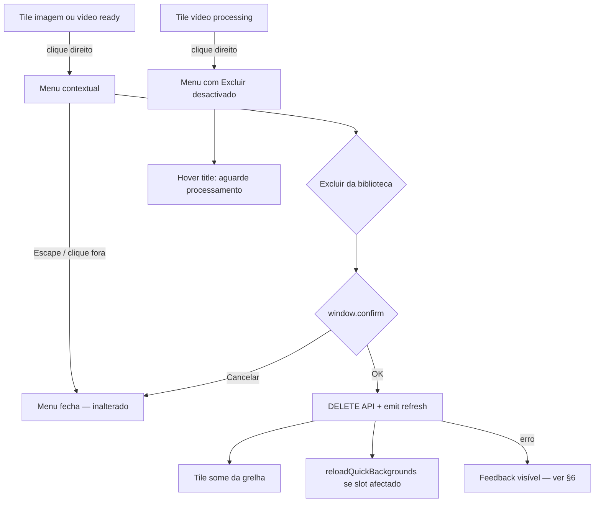

# UX Handoff — Excluir imagens e vídeos da biblioteca (CAD-300)

**Iniciativa:** [CAD-300](/CAD/issues/CAD-300)  
**Escopo PM:** [escopo.md](./escopo.md)  
**Implementação:** [CAD-305](/CAD/issues/CAD-305) (Frontend) · **API:** [CAD-304](/CAD/issues/CAD-304) · **QA:** [CAD-306](/CAD/issues/CAD-306)

**Verificação visual (2026-05-31):** mock `mock-media-context-menu-delete.html` — screenshots Chrome headless no diretório do escopo: `screenshot-desktop-menu.png`, `screenshot-mobile-menu.png` (1440×900 / 390×844). Superfície: grelha Imagens/Vídeos + `MediaTileContextMenu.vue` (as-is sem exclusão; mock representa to-be).

---

## 1. Decisões de interacção

| Decisão | Escolha | Lentes |
|---------|---------|--------|
| Acção | **Clique direito** no tile → menu existente + nova entrada no fundo | Jakob's Law (`MediaTileContextMenu`) |
| Confirmação | **`window.confirm`** antes do `DELETE` | Jakob's Law (paridade `WorshipPanel.deleteSong`); Recognition over Recall |
| Irreversível | Copy explícita + linha sobre fila (Should) | Loss Aversion; Forgiveness (confirmar destrutivo, sem undo) |
| «Remover da fila» | **Não** neste menu — distinto [CAD-234](/CAD/issues/CAD-234) | Mental model; Information Scent |
| Vídeo `processing` | Entrada **desactivada** + `title` explicativo | Constraints; Postel's Law (não falhar silenciosamente) |
| Vídeo `error` | Exclusão **permitida** (ficheiro parcial/errado pode ser removido) | Pareto 80/20 |
| Undo / lixeira | **Fora de escopo** | Occam's Razor |
| Modal a11y em vez de `confirm` | **Could** — não bloqueia Must | Progressive Disclosure |

**Hick's Law:** uma entrada destrutiva isolada após separador — não misturar com acções neutras (Gestalt **Common Region** + **Proximity**).

**Paradox of the Active User:** operador mantém biblioteca sem explorador de ficheiros; confirmação única evita cliques acidentais sem friccção excessiva (uma caixa nativa, não wizard).

---

## 2. Fluxo operador



**Meta (Goal-Gradient):** confirmar exclusão e ver biblioteca actualizada em **&lt; 15 s** (escopo §6).

**Doherty Threshold:** após OK no confirm, tile desaparece no próximo `refresh` — spinner no tile **não** é obrigatório no Must; **Should:** `deleteBusy` desactiva reentrada no menu até resposta.

---

## 3. Anatomia UI (tokens existentes)

### 3.1 Menu contextual (`MediaTileContextMenu.vue`)

Reutilizar shell actual (§CAD-234 handoff):

| Elemento | Classe / token |
|----------|----------------|
| Menu container | `fixed z-[60] min-w-[14rem] rounded-md border border-lp-surface bg-lp-background py-1 text-sm text-lp-text shadow-lg` |
| Item neutro | `w-full px-3 py-2 text-left hover:bg-lp-surface` |
| Separador | `<li role="separator" class="my-1 border-t border-lp-surface" aria-hidden="true">` |
| Item destrutivo | `w-full px-3 py-2 text-left text-rose-400 transition hover:bg-rose-950/50 hover:text-rose-200` |

**Von Restorff:** cor de perigo só no item «Excluir da biblioteca» — paridade com botão lixo em `WorshipPanel.vue` (`text-rose-400`, `hover:bg-rose-950/50`). Itens neutros **sem** `text-rose-*` (contraste com [CAD-234](/CAD/issues/CAD-234) onde remoção da fila é neutra).

**Ordem (Serial Position):** manter ordem actual das 5 acções; **depois** do separador, última posição = exclusão (escopo §3.1).

### 3.2 Props novas

| Prop | Tipo | Origem |
|------|------|--------|
| `pipelineStatus` | `'ready' \| 'processing' \| 'error' \| undefined` | `VideosPanel` apenas — omitir em `ImagesPanel` |
| `displayName` | `string` (opcional) | Último segmento de `mediaPath` para confirm/aria; fallback: basename do path |

### 3.3 Estados do item «Excluir da biblioteca»

| Estado | `:disabled` | Classes extra | `title` |
|--------|-------------|---------------|---------|
| Normal (imagem ou vídeo ready/error) | `false` | destrutivo §3.1 | — |
| `pipelineStatus === 'processing'` | `true` | `opacity-50 cursor-not-allowed` (Tailwind `disabled:opacity-50` no botão) | `t('mediaContext.errors.deleteProcessing')` |
| `deleteBusy` (pedido em curso) | `true` | idem | — |
| Sem permissão operador | *fora UI* — API rejeita | — | — |

**Não** usar `window.alert` ao clicar item desactivado — `disabled` + `title` bastam (motor a11y: `aria-disabled="true"` implícito em `disabled`).

### 3.4 Confirmação (`window.confirm`)

String única com quebra de linha (`\n\n`) entre parágrafos — padrão Electron/browser:

```
{t('mediaContext.deleteConfirm', { name })}

{t('mediaContext.deleteConfirmQueueHint')}
```

Cancelar → `return` sem API. OK → `DELETE` + `emit('refresh')` + `reloadQuickBackgrounds()` (paridade `confirmReplace`).

---

## 4. Copy e i18n (Plain Language)

Chaves novas em `locales/pt-BR.json` e `install/locales/pt-BR.json` → secção **`mediaContext`**:

| Chave | pt-BR | Uso |
|-------|-------|-----|
| `mediaContext.delete` | Excluir da biblioteca | Rótulo `menuitem` |
| `mediaContext.deleteAria` | Excluir «{name}» da biblioteca | `aria-label` no botão (`name` = basename, máx. 48 chars truncados) |
| `mediaContext.deleteConfirm` | Excluir «{name}»? Esta ação não pode ser desfeita. | Primeiro parágrafo do `window.confirm` |
| `mediaContext.deleteConfirmQueueHint` | Itens na fila que usam este ficheiro deixam de projectar até serem removidos ou substituídos. | Segundo parágrafo (Should — escopo CA implícito) |
| `mediaContext.errors.delete` | Não foi possível excluir o ficheiro da biblioteca. | Erro genérico pós-`DELETE` |
| `mediaContext.errors.deleteProcessing` | Aguarde o processamento do vídeo terminar. | `title` + mensagem se operador forçar clique via teclado (edge) |

**Não** usar «Apagar», «Eliminar» ou «Remover da fila» neste fluxo — evita confusão com [CAD-234](/CAD/issues/CAD-234).

**Paridade música:** `worship.deleteConfirm` mantém estrutura de uma linha; mídia acrescenta linha Should sobre fila (escopo §3.1 item 3).

---

## 5. Lógica cliente (handoff Frontend)

```ts
// Props: pipelineStatus?, displayName? (computed from path if omitted)

const deleteDisabled = computed(
  () =>
    deleteBusy.value ||
    (props.mediaKind === 'videos' && props.pipelineStatus === 'processing'),
);

async function deleteFromLibrary(): Promise<void> {
  closeMenu();
  const name = props.displayName ?? basename(props.mediaPath);
  const msg = `${t('mediaContext.deleteConfirm', { name })}\n\n${t('mediaContext.deleteConfirmQueueHint')}`;
  if (!window.confirm(msg)) return;
  deleteBusy.value = true;
  try {
    await fetchJson(`${apiPrefix.value}`, {
      method: 'DELETE',
      headers: { 'Content-Type': 'application/json' },
      body: JSON.stringify({ path: props.mediaPath }),
    });
    await reloadQuickBackgrounds();
    emit('refresh');
  } catch (e) {
    const message = e instanceof Error ? e.message : t('mediaContext.errors.delete');
    window.alert(message); // paridade setInitialBackground / noActiveQueue
  } finally {
    deleteBusy.value = false;
  }
}
```

**`VideosPanel.vue`:** passar `:pipeline-status="item.pipelineStatus"` ao `MediaTileContextMenu`.

**Fila:** **não** remover itens com `mediaPath` apagado (escopo §3.3) — copy na confirmação cobre expectativa.

**Ética:** sem confirmshaming («Sim, quero apagar para sempre»); botões nativos OK/Cancelar.

---

## 6. Feedback de erro

| Canal | Quando |
|-------|--------|
| `window.alert` | Falha `DELETE` ou mensagem servidor (paridade erros bloqueantes em `MediaTileContextMenu`) |
| `title` no item desactivado | Vídeo em processamento |
| Banner painel | **Não** exigido no Must — opcional reutilizar padrão `VideosPanel` se já existir `error` ref partilhado |

Resposta API `409`/`400` processing → mapear para `mediaContext.errors.deleteProcessing` quando corpo indicar pipeline activo.

---

## 7. Acessibilidade (WCAG POUR)

| Critério | Especificação |
|----------|----------------|
| Estrutura | `role="menu"` + `role="menuitem"`; `role="separator"` antes do destrutivo |
| Nome | `aria-label` = `t('mediaContext.deleteAria', { name })` |
| Desactivado | `disabled` + `title` com motivo (processing) |
| Contraste destrutivo | `text-rose-400` sobre `bg-lp-background` — alinhado a controlo lixo worship |
| Alvo | `py-2` + largura total ≥ ~44px altura |
| Teclado | Escape fecha menu (existente); foco não preso em nó removido após refresh |
| Motion | Sem animação nova no menu |
| Confirmação nativa | Limitação conhecida do `window.confirm` para leitores — **Could:** modal `role="alertdialog"` futuro |

**Selective Attention:** menu `z-[60]` inalterado; modais propriedades `z-[70]` fecham antes de abrir confirm (handler fecha menu primeiro).

---

## 8. Critérios de aceite UX (ligação CA escopo)

| CA | Verificação UX |
|----|----------------|
| CA-1 | Imagem: menu → confirmar → tile some; copy «biblioteca» |
| CA-2 | Vídeo ready: idem; separador + cor destrutiva visíveis |
| CA-3 | Cancelar confirm → grelha inalterada |
| CA-4 | Vídeo processing: item desactivado + `title`; sem `DELETE` |
| CA-5 | Fundo rápido: strip sem thumb quebrado pós-refresh (comportamento Backend + `reloadQuickBackgrounds`) |
| CA-6 | Fila mantém item; copy hint na confirmação |
| CA-9 | Chaves §4 em ambos JSON de locale |
| CA-10 | Drag, projectar, outras entradas menu **inalteradas** |

---

## 9. Handoff implementação ([CAD-305](/CAD/issues/CAD-305))

| Artefacto | Acção |
|-----------|--------|
| `MediaTileContextMenu.vue` | Separador + item destrutivo + `deleteFromLibrary` + props §3.2 |
| `VideosPanel.vue` | `:pipeline-status="item.pipelineStatus"` |
| `ImagesPanel.vue` | Sem prop pipeline (só path) |
| `locales/pt-BR.json` + `install/locales/pt-BR.json` | Chaves §4 |
| `WorshipPanel.vue` | **Não alterar** — só paridade confirm/rose |
| Storybook | N/A |

**Dependência:** API [CAD-304](/CAD/issues/CAD-304) após [CAD-302](/CAD/issues/CAD-302). Frontend pode desenvolver UI com mock `DELETE` em dev.

**QA ([CAD-306](/CAD/issues/CAD-306)):** viewports 1440×900 e 390×844; estados: menu aberto (imagem + vídeo), item desactivado (processing), confirm cancel/OK, erro API simulado.

---

## 10. Riscos residuais

| Risco | Mitigação UX |
|-------|----------------|
| Confundir com «Remover da fila» | Copy «da biblioteca»; separador + cor rose só no item destrutivo |
| Excluir vídeo a processar | `disabled` + `title` |
| `window.confirm` pouco acessível | Documentado como Could; Must mantém paridade música |
| Menu fora do viewport | **Should:** clamp `min(clientX, innerWidth - 224)` — igual CAD-234 |
| Clique esquerdo em tile processing | Tile já `pointer-events-none` em `VideosPanel` — menu contextual ainda abre no wrapper `contents`; exclusão desactivada cobre o caso |

---

## 11. Histórico

| Versão | Data | Alteração |
|--------|------|-----------|
| 1.0 | 2026-05-31 | Handoff inicial UXDesigner ([CAD-301](/CAD/issues/CAD-301)) |
