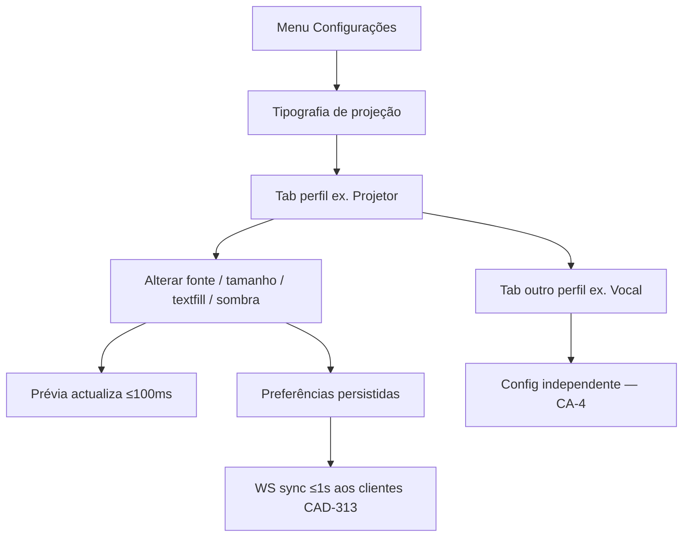

# UX Handoff — Tipografia de projeção e textfill

**Issue UX:** [CAD-308](/CAD/issues/CAD-308)  
**Escopo:** [escopo.md](./escopo.md) · **Iniciativa:** [CAD-307](/CAD/issues/CAD-307)  
**Spec:** [spec-ux-cad308.md](./spec-ux-cad308.md)  
**Implementação:** [CAD-312](/CAD/issues/CAD-312) (settings) · [CAD-313](/CAD/issues/CAD-313) (runtime)

**Verificação visual (2026-05-31):** mock `mock-projection-typography-panel.html` — viewport **1440×900** (painel desktop duas colunas) e **390×844** (tabs scroll + coluna única). Screenshots nesta pasta: `screenshot-desktop-panel.png`, `screenshot-mobile-panel.png`.

---

## 1. Decisões de interacção

| Decisão | Escolha | Lentes |
|---------|---------|--------|
| Localização no produto | **Painel dedicado** «Tipografia de projeção» no menu Configurações | Mental Models; separar UI operador vs projeção |
| Perfis | **6 tabs** horizontais (scroll em mobile) | Chunking; Information Scent |
| Estilo tipográfico | **Segmented control** 4 estados | Hick's Law; Recognition over Recall |
| Família | **Select** com optgroups bundled / system | Jakob's Law (padrão select existente) |
| Sombra | **Toggle** + **accordion** camadas | Progressive Disclosure |
| CSS avançado | `<details>` recolhido | Progressive Disclosure; Could |
| Prévia | **Coluna direita** sticky; sample Louvor/Bíblia/Notas | Recognition over Recall; Doherty Threshold |
| Persistência | Auto-save on change (debounce 300ms) ou botão Guardar — **CTO decide**; UX prefere auto-save com toast discreto | Paradox of the Active User |
| Reset | **Por secção** (sombra, limites) — sem «reset perfil inteiro» | Forgiveness |

**Rejeitado:** fundir tipografia de projeção em `AppearancePanel` — confunde `fontScalePercent` (operador) com `maxFontPx` (público).

---

## 2. Fluxo operador



---

## 3. Anatomia UI (tokens existentes)

### 3.1 Shell modal

Reutilizar `SettingsModal.vue`:

| Elemento | Classe / prop |
|----------|----------------|
| Modal | `:wide="true"` → `max-w-4xl` |
| Body scroll | `min-h-0 flex-1 overflow-y-auto p-4` |
| Grid desktop | `lg:grid lg:grid-cols-[minmax(0,1.1fr)_minmax(0,0.9fr)] lg:gap-6` |

### 3.2 Tabs perfil

| Estado | Classe |
|--------|--------|
| Activo | `border-b-2 border-lp-primary text-lp-text font-medium` |
| Inactivo | `text-lp-muted hover:text-lp-text border-b-2 border-transparent` |
| Strip | `flex gap-1 overflow-x-auto border-b border-lp-surface mb-4` |

### 3.3 Segmented control (estilo)

```html
<div role="group" aria-label="{t('settings.projectionTypography.fontStyleGroup')}">
  <!-- botões: normal | bold | italic | boldItalic -->
</div>
```

| Estado botão | Classe |
|--------------|--------|
| Activo | `rounded-md bg-lp-primary px-3 py-2 text-sm font-medium text-white` |
| Inactivo | `rounded-md border border-lp-surface px-3 py-2 text-sm text-lp-text hover:bg-lp-surface/50` |

**Motor a11y:** `aria-pressed="true|false"`; grupo `role="group"`.

### 3.4 Camada de sombra (card)

| Elemento | Classe |
|----------|--------|
| Card | `rounded-lg border border-lp-surface bg-lp-surface/20 p-3 space-y-3` |
| Label campo | `text-xs font-medium text-lp-muted` |
| Range | `min-w-0 flex-1` (paridade fontScale) |
| Valor numérico | `w-14 shrink-0 text-right tabular-nums text-lp-muted` |

### 3.5 Banner aviso (fonte sistema)

Quando `fontSource === 'system'`:

```
rounded-md border border-amber-500/40 bg-amber-950/40 px-3 py-2 text-xs text-amber-100
```

Ícone opcional `AlertTriangle` lucide — não obrigatório MVP.

### 3.6 Prévia (`ProjectionTypographyPreview.vue`)

| Elemento | Classe |
|----------|--------|
| Frame | `projection-preview-frame aspect-video w-full overflow-hidden rounded-xl border border-lp-surface bg-black shadow-inner` |
| Selector sample | `flex gap-2 mb-2` — botões pill `text-xs` |
| Legenda | `text-xs text-lp-muted mt-2` |

Import: `@shared/projection-layout.css`.

---

## 4. Chaves i18n pt-BR (Must — CA-14)

Prefixo: `settings.projectionTypography.*`

```json
{
  "settings": {
    "projectionTypography": {
      "title": "Tipografia de projeção",
      "menuLabel": "Tipografia de projeção",
      "intro": "Configure fonte, tamanho e sombra do texto projectado para cada destino. Alterações aplicam-se aos clientes de projeção em cerca de um segundo.",
      "profiles": {
        "projector": "Projetor",
        "stageReturn": "Retorno palco",
        "live": "Live",
        "vocal": "Vocal",
        "stage": "Palco",
        "player": "Player"
      },
      "sections": {
        "font": "Fonte",
        "size": "Tamanho",
        "textfill": "Auto-ajuste",
        "shadow": "Sombra no texto"
      },
      "fontSource": "Origem da fonte",
      "fontSourceBundled": "Fontes do Live Praise",
      "fontSourceSystem": "Fontes do sistema",
      "fontSourceSystemWarning": "Fontes do sistema dependem do equipamento que projecta. Tablets ou PCs remotos podem não ter a mesma fonte instalada.",
      "fontFamily": "Família tipográfica",
      "fontFamilyBundledGroup": "Fontes do Live Praise",
      "fontFamilySystemGroup": "Fontes do sistema",
      "fontStyleGroup": "Estilo",
      "fontStyle": {
        "normal": "Normal",
        "bold": "Negrito",
        "italic": "Itálico",
        "boldItalic": "Negrito itálico"
      },
      "minFontPx": "Tamanho mínimo",
      "maxFontPx": "Tamanho máximo",
      "minMaxUnit": "px",
      "minMaxHint": "Na saída real o texto cresce até ao máximo que couber na área útil.",
      "minMaxError": "O mínimo não pode ser maior que o máximo.",
      "textfillEnabled": "Auto-ajustar texto para caber",
      "textfillHint": "Reduz ou aumenta a fonte para evitar scroll e corte. Desligado usa o tamanho máximo fixo.",
      "textShadowEnabled": "Usar sombra no texto",
      "textShadowDisabledHint": "Texto plano, sem contorno ou sombra.",
      "shadowLayersTitle": "Camadas de sombra",
      "shadowLayer": "Camada {index}",
      "shadowOffsetX": "Deslocamento horizontal",
      "shadowOffsetY": "Deslocamento vertical",
      "shadowBlur": "Desfoque",
      "shadowColor": "Cor",
      "shadowAddLayer": "Adicionar camada",
      "shadowRemoveLayer": "Remover última camada",
      "shadowRestoreDefault": "Restaurar padrão",
      "shadowAdvancedTitle": "Modo avançado (CSS)",
      "shadowAdvancedHint": "Apenas para utilizadores experientes. CSS inválido será ignorado.",
      "shadowAdvancedError": "Não foi possível aplicar este CSS. Verifique a sintaxe.",
      "preview": {
        "title": "Prévia",
        "sampleLabel": "Texto de exemplo",
        "sampleWorship": "Louvor longo",
        "sampleBible": "Bíblia",
        "sampleNotes": "Notas curtas",
        "footnote": "Prévia: o texto cabe nesta área. Em {destination} a fonte pode ser maior.",
        "sample": {
          "worshipLine": "Senhor, eu sei que Tu és fiel",
          "worshipBody": "Em cada estação do meu caminho\nTu estás comigo, não me deixas só\nQuando a noite cai e o medo vem\nTua luz dissipa toda escuridão\n\nConfio no Teu amor que não falha\nConfio na Tua mão que me guia\nMesmo em provas, mesmo em dor\nSei que és o meu Senhor",
          "worshipFooter": "Exemplo de louvor (Artista)",
          "bibleTitle": "Salmos 23:1",
          "bibleBody": "O Senhor é o meu pastor; nada me faltará.",
          "notesBody": "Intervalo — 5 min"
        }
      },
      "saved": "Tipografia guardada.",
      "saveError": "Não foi possível guardar. Tente novamente."
    }
  },
  "actions": {
    "projectionTypography": "Tipografia de projeção"
  }
}
```

**Nota implementação:** mesclar no `locales/pt-BR.json` existente; não duplicar chaves `settings.theme`.

---

## 5. Hierarquia sombra — comportamento

| Estado UI | Comportamento |
|-----------|---------------|
| Toggle off | `textShadowLayers` preservadas em prefs mas **não aplicadas**; accordion disabled visual (`opacity-50 pointer-events-none`) |
| Toggle on | Aplicar camadas via `projection-text-shadow.ts`; accordion expandido por default na 1.ª visita |
| Restaurar padrão | Substituir array pelas 4 camadas legado; **não** alterar toggle |
| Adicionar | Nova camada `{ offsetX:0, offsetY:0, blur:0, color:'#000000' }` |
| Remover última | Disabled se `length <= 1` |
| Modo avançado | Se preenchido e válido, **substitui** camadas na renderização (Could); UI principal read-only enquanto advanced activo |

**Peak-End Rule:** após «Restaurar padrão», flash subtil na prévia (outline `ring-1 ring-lp-primary` 300ms) — **Should**, não bloqueia MVP.

---

## 6. Sincronização prévia settings ↔ tiles operador

| Tile prévia operador | Chave config |
|----------------------|--------------|
| Projetor | `projector` |
| Retorno palco | `stageReturn` |
| Live / external live | `live` |
| Vocal | `vocal` |
| Stage | `stage` |
| Player | `player` |

Alterar tab «Vocal» no settings **não** afecta `projector` (CA-4). Tiles usam a mesma config após [CAD-313](/CAD/issues/CAD-313).

---

## 7. Critérios de aceite UX (handoff QA)

| ID | Verificação |
|----|-------------|
| UX-1 | Painel abre via Configurações → Tipografia de projeção |
| UX-2 | 6 tabs navegáveis; mobile scroll horizontal |
| UX-3 | Prévia Louvor ≥12 linhas sem overflow no frame |
| UX-4 | Segmented control reflecte peso+estilo na prévia |
| UX-5 | Sombra padrão 4 camadas visível sobre fundo escuro |
| UX-6 | Toggle sombra off → texto plano |
| UX-7 | Banner system fonts ao seleccionar origem sistema |
| UX-8 | Erro inline min>max |
| UX-9 | Todas chaves §4 presentes em pt-BR |

---

## 8. Verificação visual (CAD-308)

```bash
cd /path/to/livepraise
python3 -m http.server 8765
# http://localhost:8765/Escopos/cad307_tipografia_projecao_textfill/mock-projection-typography-panel.html
```

| Viewport | Superfície |
|----------|------------|
| 1440×900 | Modal wide — controlos + prévia lado a lado |
| 390×844 | Tabs scroll; preview abaixo; segmented wrap |

---

## 9. Riscos residuais

| Risco | Mitigação |
|-------|-----------|
| Modal estreito em tablet landscape | `:wide="true"` + breakpoint `lg:` para duas colunas |
| Lista system fonts longa | Select nativo com optgroup; filtro **Could** |
| Preview vs output sizing confunde operador | Copy footnote §4 `preview.footnote` |
| Accordion sombra intimidante | Default colapsado após 1.ª configuração — **Should** remember pref |

---

## 10. Resumo para [CAD-312](/CAD/issues/CAD-312)

1. Novo `ProjectionTypographyPanel.vue` + `ProjectionTypographyPreview.vue`.
2. Entrada menu + `SettingsPanel` type + título modal.
3. Schema `projectionTypography` em `usePreferences`.
4. UI conforme §3 tokens `lp-*`; sem valores one-off.
5. i18n §4 completo.
6. Prévia invoca helpers partilhados quando [CAD-313](/CAD/issues/CAD-313) existir; até lá, mock lógica inline aceite com TODO.

**Status UX:** entrega completa — [CAD-312](/CAD/issues/CAD-312) desbloqueada.
