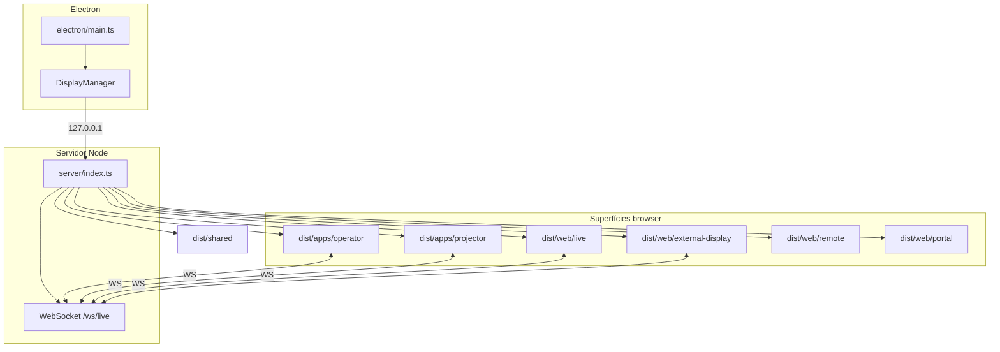

# Arquitectura runtime — Live Praise

Visão geral do processo Electron + servidor HTTP + superfícies web (ST-008, ST-013).

## Diagrama

## Mounts Express (`server/index.ts`)

| Path | Pasta / origem | Descrição |
|------|----------------|-----------|
| `/api/*` | Rotas em `server/routes/` | REST JSON |
| `/api/operator-queue` | `operator_queue_state` (SQLite) | Configuração, revisão e snapshot da fila compartilhada |
| `/shared` | `dist/shared/` | Módulos TS compilados (textfill, tipografia, overlays) |
| `/projector` | `dist/apps/projector/` | Saída pública (monitor projeção) |
| `/operator` | `dist/apps/operator/` | UI operador (Vue 3) |
| `/live` | `dist/web/live/` | Visualizador live (browser) |
| `/vocal`, `/stage`, `/player` | `dist/web/external-display/` | Ecrãs externos |
| `/remote` | `dist/web/remote/` | Controlo remoto web |
| `/` | `dist/web/portal/` | Portal inicial |
| `/imagens`, `/videos` | `~/livepraise/{imagens,videos}` | Mídia do utilizador |
| `/fonts` | `~/livepraise/fonts` + bundled | Fontes de projeção |

**Nota:** `apps/stage-return/` compila para `dist/apps/stage-return/` mas o retorno de palco em runtime usa `/stage/` → `web/external-display/` (ver ST-004 no plano).

## WebSocket

- Path: `/ws/live`
- Contrato: `shared/types/live.ts`
- Hub: `server/websocket/live-hub.ts`
- Papéis: `operator`, `projector`, `stage-return`, `external-display`, etc.

Eventos de tipografia de projeção propagam preferências (`projection-typography`) para todas as saídas via `attachProjectionTypographyWs` em `shared/projection-typography-runtime.ts`.

### Fila compartilhada de operadores

- É opcional e global; por padrão cada operador conserva a fila no `localStorage`.
- Ao habilitar em **Configurações → Sincronização da fila**, a fila do operador que ativou torna-se o snapshot autoritativo.
- Alterações usam `PUT /api/operator-queue` com revisão otimista. Revisões antigas recebem `409` e o snapshot atual.
- O hub transmite `operator-queue-sync` apenas para clientes com papel `operator`; projetores e remotos não recebem a fila.
- Abas e itens são compartilhados. Aba ativa e item selecionado continuam locais em cada computador.
- Desabilitar conserva o último snapshot no servidor, mas interrompe a sincronização.

## Cache de estáticos (ST-015)

Política em `server/index.ts` — evitar HTML/JS stale em desenvolvimento:

| Mount | `index.html` | Bundles JS (hash) | `/shared/*.js` | Fontes `/fonts` |
|-------|--------------|-------------------|----------------|-----------------|
| `/operator` | `no-store` | cache default Express (hash no filename Vite) | — | — |
| `/projector` | `no-store` | cache default | — | — |
| `/live`, `/vocal`, `/stage`, `/player` | `no-store` | cache default | — | — |
| `/shared` | — | — | `no-store` | — |
| `/fonts` | — | — | — | `max-age` (rotas API) |

Portal e remote usam `express.static` simples (SPA dev raro); operador e saídas de projeção têm prioridade em dev local.

## Build e empacotamento

Ver [`BUILD.md`](BUILD.md). O `electron-builder` inclui `dist/**/*` e `web/**/*`; artefactos browser compilados vivem só em `dist/`.

## Camadas de código

| Pasta | Responsabilidade |
|-------|------------------|
| `electron/` | Processo principal, monitores, splash, auto-update |
| `server/` | HTTP, WS, rotas, serviços (vídeo, watcher, backup) |
| `core/` | Lógica de domínio (auth, temas, projeção, audit) |
| `shared/` | Tipos e runtime partilhado browser+server |
| `apps/operator/` | Fonte Vue operador |
| `apps/projector/src/` | Fonte TS projetor |
| `web/` | Views web públicas (migração TS em curso) |
