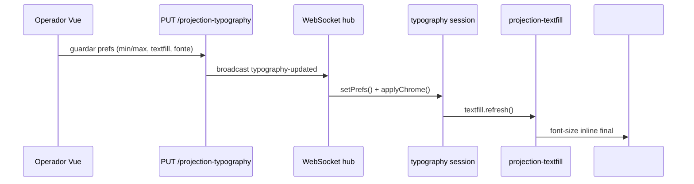

# Textfill de projeção

Motor de redimensionamento de texto para caber na área útil da projeção (substituto do jQuery TextFill).  
Documento TF-001 … TF-004; auditoria de integração TF-005.

## Camadas

```text
shared/projection-textfill.ts              ← ÚNICO motor (algoritmo + createProjectionTextfill)
shared/projection-typography.ts            ← perfis / prefs / estilos CSS
shared/projection-typography-runtime.ts    ← tipografia (fonte, sombra, prefs, WS) — NÃO é textfill
apps/operator (Vue)                        ← useProjectionTypographyPreview → createProjectionTextfill
projector / live / external / stage-return ← chamam createProjectionTextfill + sessão tipografia
```

## Modelo de uso (paridade jQuery TextFill)

```ts
import { createProjectionTextfill } from '/shared/projection-textfill.js';
import { createProjectionTypographySession } from '/shared/projection-typography-runtime.js';

const typography = createProjectionTypographySession({ rootEl, role: 'projector' });
const textfill = createProjectionTextfill({
  rootEl,
  mode: 'output',
  resolve: () => typography.resolveTextfillParams(),
  beforeRefresh: () => typography.applyChrome(),
});

await typography.init(prefs);
textfill.attach([stageEl]);
await textfill.refresh();
// após mudar o HTML:
textfill.scheduleRefresh();
```

O fit **só** altera `font-size`; fonte/sombra vêm da sessão tipográfica (como CSS à parte do plugin jQuery).

## Modos

| Modo | Função | Uso |
|------|--------|-----|
| `preview` | `applyPreviewTextfill` / `refreshPreviewTextfill` | Tiles do operador; `minPx` pode ir a 8px |
| `output` | `applyOutputTextfill` / `refreshOutputTextfill` | Projetor, live, ecrãs externos |
| `output` (batch) | `refreshOutputTextfillAll` | Retorno de palco — cada `.texto` ou acoplado `.atual`/`.proximo` |
| binding | `createProjectionTextfill` | Resize + scheduleRefresh no mesmo módulo |

## API pública do motor (TF-002)

| Export | Descrição |
|--------|-----------|
| `createProjectionTextfill(opts)` | Handle estilo plugin (`refresh` / `scheduleRefresh` / `attach` / `disconnect`) |
| `applyPreviewTextfill` / `refreshPreviewTextfill` | Prévia |
| `applyOutputTextfill` / `refreshOutputTextfill` | Saída |
| `refreshOutputTextfillAll` / `applyOutputTextfillAll` | Retorno de palco |
| `waitForProjectionTypographyLayout` | Aguarda `@font-face` antes de medir |
| `PREVIEW_TEXTFILL_MIN_PX` | Constante 8 — piso na prévia |
| `STAGE_RETURN_OUTPUT_FLOOR_PX` | Constante 10 — piso retorno de palco |
| `PROJECTION_TEXTFILL_RESIZE_DEBOUNCE_MS` | 120 — resize |
| `PROJECTION_TEXTFILL_PREVIEW_REFRESH_DEBOUNCE_MS` | 32 — schedule em prévia |

## Quando usar o quê (TF-003)

| Contexto | Usar |
|----------|------|
| Projetor, live, external-display, stage-return | `createProjectionTextfill` + `createProjectionTypographySession` |
| Prévia operador | `useProjectionTypographyPreview()` (chama o motor) |
| Testes unitários / smokes | Imports directos do motor |
| Conveniência (legado) | `createProjectionTypographyController` ainda existe e só compõe tipografia + textfill |

## Fluxo operador → projetor (TF-004)



## Integração tipografia vs motor (TF-005)

| Responsabilidade | Ficheiro |
|------------------|----------|
| Algoritmo + resize binding | `shared/projection-textfill.ts` |
| Fonte, sombra, prefs, WS | `shared/projection-typography-runtime.ts` |
| Prévias Vue | `useProjectionTypographyPreview` → `createProjectionTextfill` |

TF-026 ADR: não criar `<ProjectionContent>` — ver [`TF-026-ADR-projection-content.md`](TF-026-ADR-projection-content.md).

## Diagnóstico (TF-021)

### Activar

1. Operador → **Configurações** → **Logs de erro**
2. Activar o toggle **diagnóstico textfill** (persiste em `localStorage` via `@shared/projection-textfill-diagnostics`)
3. Reproduzir o caso (louvor longo, Bíblia, troca de verso) com prévia e/ou projetor abertos

### Onde ficam os dados

| Destino | Caminho |
|---------|---------|
| Ficheiro no disco | `~/livepraise/textfill-diagnostics.jsonl` (JSONL, uma linha por medição) |
| API (operador autenticado) | `GET /api/system/textfill-diagnostics` |
| UI | Configurações → Logs de erro (últimas 80 entradas; exportar JSONL) |

### Suporte

1. Pedir export JSONL na UI ou copiar `~/livepraise/textfill-diagnostics.jsonl`
2. Campos úteis: `surface`, `mode`, `resultFontPx`, `heightOverflow`, `textSnippet`
3. Limpar: botão na UI ou `DELETE /api/system/textfill-diagnostics`

Módulos: `shared/projection-textfill-diagnostics.ts`, `core/textfill-diagnostics/`; tipo `TextfillDiagnosticEntry` em `@core/textfill-diagnostics/types`.

## CSS

Estilos de layout: `shared/projection-layout.css` — `.content > span` recebe `font-size` inline do textfill.

## Testes

- `tests/projection-textfill-fit.test.mjs`
- `tests/projection-textfill-two-pass.test.mjs`
- `tests/projection-textfill-visibility.test.mjs`

Integrados em `npm run smoke:textfill` e `npm run smoke:typography-qa` (SM-010/030).

## Validação estática (TF-013, TF-014)

| Superfície | Integração textfill | Estado |
|------------|---------------------|--------|
| Projetor | `createProjectionTextfill` + sessão tipografia | ✅ |
| Live / external-display | Idem | ✅ |
| Operador (prévia) | composable → `createProjectionTextfill` | ✅ |
| Retorno palco (`/stage`) | `allTexto: true` via params do motor | ✅ |
| `apps/stage-return/` (legado) | Compila mas **não** servido HTTP — Electron usa `/stage/` | ⚠️ ver ST-004 |
