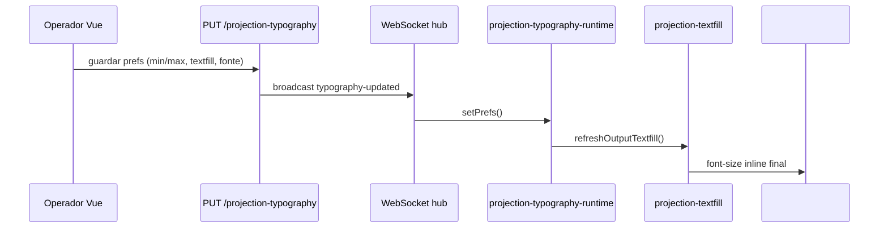

# Textfill de projeção

Motor de redimensionamento de texto para caber na área útil da projeção (substituto do jQuery TextFill).  
Documento TF-001 … TF-004; auditoria de duplicação TF-005.

## Camadas

```text
shared/projection-textfill.ts           ← motor (busca binária, preview vs output)
shared/projection-typography-runtime.ts ← createProjectionTypographyController()
shared/projection-typography.ts         ← perfis, prefs, estilos CSS
apps/operator (Vue)                     ← prévias (caminho a unificar — ver TF-005)
projector / external-display / live     ← saídas via controller
```

## Modos

| Modo | Função | Uso |
|------|--------|-----|
| `preview` | `applyPreviewTextfill` / `refreshPreviewTextfill` | Tiles do operador; `minPx` pode ir a 8px |
| `output` | `applyOutputTextfill` / `refreshOutputTextfill` | Projetor, live, ecrãs externos |
| `output` (batch) | `refreshOutputTextfillAll` | Retorno de palco — cada `.texto` ou acoplado `.atual`/`.proximo` |

## API pública do motor (TF-002)

| Export | Descrição |
|--------|-----------|
| `applyPreviewTextfill(el, min, max, enabled, opts?)` | Síncrono; prévia |
| `applyOutputTextfill(el, min, max, enabled, opts?)` | Síncrono; saída |
| `refreshPreviewTextfill(el, min, max, enabled, opts?)` | Async; aguarda fontes/layout |
| `refreshOutputTextfill(el, min, max, enabled, opts?)` | Async; saída real |
| `refreshOutputTextfillAll(root, min, max, enabled, opts?)` | Async; múltiplos `.texto` |
| `waitForProjectionTypographyLayout(opts?)` | Aguarda `@font-face` antes de medir |
| `PREVIEW_TEXTFILL_MIN_PX` | Constante 8 — piso na prévia |

### `ProjectionTextfillOptions` (principais)

| Opção | Descrição |
|-------|-----------|
| `spanSelector` | Selector do nó de texto (default `.content > span`) |
| `allTexto` | Via runtime — retorno de palco |
| `maxFontPxScale` | Escala para `.proximo` vs `.atual` |
| `fitSlackPx` | Margem extra (sombra de texto) |
| `suppressVisibilityToggle` | Evita flash em batch |
| `diagnosticSurface` | Label nos logs JSONL |
| `fontFamily`, `fontWeight`, `fontStyle` | Medição com fonte correcta |

## Quando usar o quê (TF-003)

| Contexto | Usar |
|----------|------|
| Projetor, live, external-display, stage (`/stage/`) | `createProjectionTypographyController()` |
| Testes unitários / smokes | Imports directos do motor |
| Prévia operador | `useProjectionTypographyPreview()` composable |
| Configurações → Tipografia | Idem composable |

**Regra alvo:** produção usa sempre o **controller** ou composable Vue que o encapsula; o motor directo fica restrito a testes.

## Fluxo operador → projetor (TF-004)



## Auditoria de duplicação — operador (TF-005)

Lógica **duplicada** entre `PreviewOutputTile.vue` / `ProjectionTypographyPreview.vue` e `createProjectionTypographyController`:

| Comportamento | Runtime (controller) | Operador (actual) |
|---------------|----------------------|-------------------|
| Aplicar font-family/weight/style | `applyProjectionTypographyStyles` | `applyProjectionTypographyStyles` ✓ mesmo |
| Text shadow CSS | `resolveProjectionTextShadowCss` + slack | Idem via computed ✓ |
| Textfill | `refreshPreviewTextfill` via `runTextfill` | `refreshPreviewTextfill` directo ✓ |
| `fitSlackPx` | `projectionTextShadowSlackPx` | Idem ✓ |
| Debounce resize | 120 ms + `ResizeObserver` | 32 ms refresh / 120 ms resize — **timings diferentes** |
| Geração/cancel refresh | `refreshGeneration` | `refreshGeneration` ✓ padrão similar |
| WS sync prefs | `attachProjectionTypographyWs` | N/A (lê `usePreferences` local) |
| `@font-face` inject | `ensureFontFaceStyle` no controller | `fontFaceCss` computed + `<style>` no tile |
| `diagnosticSurface` | `operator-preview:${label}` implícito | Passado explicitamente ✓ |

**Conclusão TF-005:** funcionalidade equivalente, mas **dois caminhos de integração**. Tarefas TF-006–TF-012 unificam via composable `useProjectionTypographyPreview`.

## Diagnóstico (TF-021)

### Activar

1. Operador → **Configurações** → **Logs de erro**
2. Activar o toggle **diagnóstico textfill** (persiste em `localStorage` via `@shared/projection-textfill-diagnostics`)
3. Reproduzir o caso (louvor longo, Bíblia, troca de verso) com prévia e/ou projetor abertos

### Onde ficam os dados

| Destino | Caminho |
|---------|---------|
| Ficheiro no disco | `~/livepraise/textfill-diagnostics.jsonl` (JSONL, uma linha por medição) |
| API (operador autenticado) | `GET /api/system/textfill-diagnostics` |
| UI | Configurações → Logs de erro (últimas 80 entradas; exportar JSONL) |

### Suporte

1. Pedir export JSONL na UI ou copiar `~/livepraise/textfill-diagnostics.jsonl`
2. Campos úteis: `surface`, `mode`, `resultFontPx`, `heightOverflow`, `textSnippet`
3. Limpar: botão na UI ou `DELETE /api/system/textfill-diagnostics`

Módulos: `shared/projection-textfill-diagnostics.ts`, `core/textfill-diagnostics/`; tipo `TextfillDiagnosticEntry` em `@core/textfill-diagnostics/types`.

## CSS

Estilos de layout: `shared/projection-layout.css` — `.content > span` recebe `font-size` inline do textfill.

## Testes

- `tests/projection-textfill-fit.test.mjs`
- `tests/projection-textfill-two-pass.test.mjs`
- `tests/projection-textfill-visibility.test.mjs`

Integrados em `npm run smoke:textfill` e `npm run smoke:typography-qa` (SM-010/030).

## Validação estática (TF-013, TF-014)

| Superfície | Integração textfill | Estado |
|------------|---------------------|--------|
| Projetor | `createProjectionTypographyController` — sem import directo do motor | ✅ |
| Live / external-display | Idem via `projection-typography-runtime` | ✅ |
| Operador (prévia) | `useProjectionTypographyPreview` → `refreshPreviewTextfill` | ✅ |
| Retorno palco (`/stage`) | `textfillOptions: { allTexto: true }` em external-display | ✅ |
| `apps/stage-return/` (legado) | Compila mas **não** servido HTTP — Electron usa `/stage/` | ⚠️ ver ST-004 |
